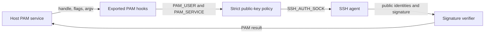

# PAM boundary audit

- Candidate code: `64ff5ac`
- Artifact SHA256: `0fe8d4c20693b58b596379f7c7c0b2201c79ff0bb90c9169bcb433adac6dba97`
- Audit status: source, sanitizer, and root OpenPAM qualification checks pass.

This record applies to the arm64 macOS 27 strict profile. Xcode 27.0
(27A266a), macOS SDK 27.0 (26A425), Apple Clang 21.0.0, Rust 1.96.1,
and Rust nightly 1.98.0 were used.

## Data flow and trust boundaries

The PAM handle, module arguments, environment, policy path, agent socket, and
agent replies cross trust boundaries. The strict profile accepts one selected
root-controlled public key. It treats the agent as untrusted until a returned
signature verifies against that key and the fresh challenge.

The module does not read PAM authentication tokens, passwords, private-key
files, or private-key material. Production PAM item access is limited to
`PAM_USER` and `PAM_SERVICE`. The agent performs the private-key operation.
The production module does not construct `PrivateKey`; test fixtures do. The
`PAM_AUTHTOK` identifiers remain in the platform binding but are not requested
by production code.

Helpers, certificates, security-key policy, forwarded agents, and non-sudo PAM
hosts are outside this baseline. Their code remains subject to the general
bounds, but each needs separate profile qualification.

## Unsafe and FFI inventory

| Source | Operation and ownership | Audit result |
| --- | --- | --- |
| `vendor/pam-bindings/src/macros.rs` | Six C entry points validate the handle, count, array, and null elements before they create Rust views. PAM owns the inputs for the call. | The ABI checks pass. Panics return `PAM_ABORT`. Ordinary payloads are dropped inside a second guard. A recursively panicking destructor causes the secondary payload to be forgotten so no unwind crosses C. |
| `vendor/pam-bindings/src/module.rs` | PAM get/set calls borrow items or transfer a boxed module value to PAM. Failed transfers reconstruct the box. The cleanup callback owns and drops a successful transfer once. | Null results and PAM errors propagate. Cleanup and panic-payload drops are contained. `get_data<T>` retains its documented type precondition. |
| `vendor/pam-bindings/src/items.rs` | Item wrappers borrow terminated strings or the conversation structure returned by PAM. | The references remain tied to the PAM handle borrow and match the installed ABI. |
| `vendor/pam-bindings/src/conv.rs` and `secret.rs` | A successful conversation response is copied, zeroized, and freed with `libc::free`. | The installed `pam_conv(3)` contract makes the callback release its own allocations on failure, so the binding must not free a failed response. |
| `src/agent_connection.rs` | Unix socket, `fcntl`, `connect`, `poll`, and `getsockopt` calls use validated path lengths and nonnegative descriptors. `OwnedFd` receives each successful descriptor once. | Ownership and deadline loops are sound. No descriptor leak was found. |
| `src/trust_path.rs` | `open`, `openat`, ACL access, and `File::from_raw_fd` operate on normalized components and successful descriptors. | Owner, mode, type, link, ACL, parent snapshot, and post-read checks bind the policy to the opened objects. |
| `src/cmd.rs` | Child setup uses `setgroups`, `setgid`, `setuid`, `setrlimit`, nonblocking pipes, `poll`, process-group signals, and reap calls. | System-call results fail closed. Descriptors, output, children, and deadlines are bounded. Helpers remain excluded from this profile. |

Malformed non-null foreign pointers cannot be made safe by a PAM module. The
host must meet the C ABI requirement that a non-null handle and each declared
argument point to valid objects for the call duration.

## Vendored binding review

The vendored crate matches `pam-bindings` 0.3.0 at source commit
`d0c1bca3be13030e2a371ecc7b8d801a664e0793`, apart from recorded changes:

- platform constants are split into unchanged Linux values and SDK-derived
  macOS values;
- macOS item identifiers and message-style differences are selected by target;
- exported flags use the signed C type required by Apple headers;
- item-access errors and null values propagate;
- hook arguments are validated before Rust views are created; and
- hook and cleanup panics cannot unwind across the C ABI.

The crate checksum, license, omitted upstream examples, and source provenance
are recorded in `vendor/pam-bindings/VENDORED.md`.

## Logging boundary

AUTHPRIV logging is best effort. Initialization failure cannot change a PAM
result. Unix logging sockets are nonblocking, and logger state uses `try_lock`,
so a missing, busy, or full transport cannot wait for another request.

Each message value is escaped and limited to 1,024 bytes. The PAM service
prefix is escaped and limited to 128 bytes. Logs omit public-key fingerprints,
policy and agent paths, policy contents, helper commands, helper output,
certificate principals, and detailed parser or authentication errors.
Request debug state is thread-local and resets after the request. Tests cover
control characters, limits, initialization failure, a `WouldBlock` transport,
and concurrent debug isolation.

## Sanitizer evidence

| Check | Result |
| --- | --- |
| AddressSanitizer | `scripts/test-macos-asan.sh` passes 72 nonprivileged project tests with 5 ignored qualification tests, plus 6 vendored PAM tests. It exercises real `pam_start`, authentication and credential hooks, invalid inputs, contained panics, Unix agent traffic, and hostile frames. |
| ThreadSanitizer | Five logging boundary tests pass with nightly Rust `-Zsanitizer=thread`, including concurrent request debug state and `WouldBlock` transport handling. |
| Rust UndefinedBehaviorSanitizer | Unsupported. Nightly 1.98 rejects `-Zsanitizer=undefined`. Xcode DocumentationSearch states that Xcode UBSan supports C-based languages; it cannot instrument this Rust implementation. |
| Miri and libFuzzer | Not used. Miri cannot execute the Apple PAM, ACL, syslog, and Unix-socket FFI surface. No `cargo-fuzz` target is present. ASan covers the required entry-point runtime gate. |

ASan leak detection is disabled for this suite. The C boundary intentionally
forgets only a secondary panic payload whose destructor also panics. This rare
failure path trades a bounded allocation for the requirement that Rust never
unwind into the PAM host. Release soak and retained-memory gates remain in #29.

## Artifact and remaining gates

The candidate dylib is 1,459,200 bytes. It has arm64 architecture, macOS 27.0
minimum OS and SDK values, string-table offset 1,198,352, install name
`pam_ssh_agent.so`, six PAM exports, and only `libpam`, `libiconv`, and
`libSystem` dependencies. Its full linker CDHash is
`9009245f6c8f56868fd62c5ea78129baa1c949a3cde5e1ee7295fba7760fe716`.
Strict signature verification and the unprivileged dyld preflight pass.

The root OpenPAM harness passes through real `pam_start`, `pam_authenticate`,
`pam_setcred`, and `pam_end` handles. Across its six reported samples, elapsed
time is 0-3 ms, CPU time is 472-3,031 us, file-descriptor change is -1 or 0,
and maximum resident size is 6,160,384-7,110,656 bytes. It leaves no fixture
under `/private/etc/security`, `/private/etc/pam.d`, `/private/tmp`, or `/tmp`.

Live Apple `/usr/bin/sudo`, fallback, rollback, long soak, signing, packaging,
and release promotion remain separate roadmap gates.

## Source gate

Xcode DocumentationSearch supplied *Diagnosing memory, thread, and crash issues
early* for Apple sanitizer scope. The installed SDK headers and the installed
`pam_conv(3)`, `pam_authenticate(3)`, `pam_setcred(3)`, and `pam.conf(5)` manuals
supply the OpenPAM ABI and ownership rules that Xcode DocumentationSearch did
not return.
